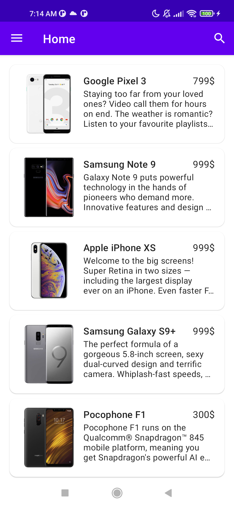
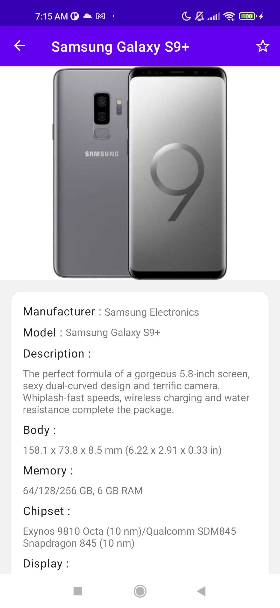
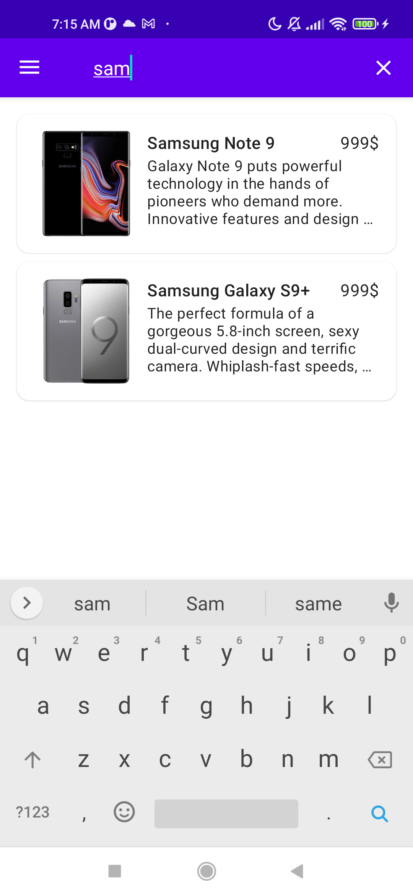
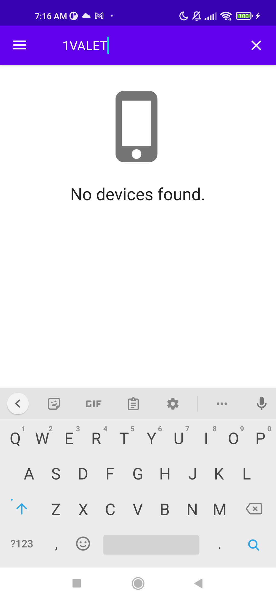
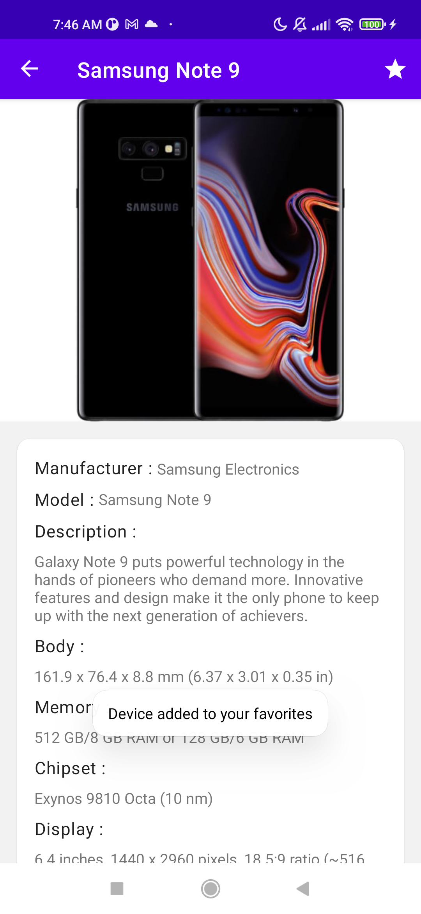
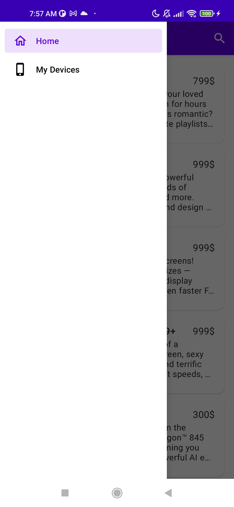

<h1 align="center">PhoneApp</h1>

You can download the [apk here](https://github.com/faycal-test/PhoneApp/raw/master/PhoneApp.apk).   

<table>
  <tr>
    <td>Home screen</td>
     <td>Device Details</td>
     <td>Search devices</td>
  </tr>
  <tr>
    <td align="center"></td>
       <td align="center"></td>
    <td align="center"></td>
  </tr>
   <tr>
    <td align="center">Search devices without results</td>
     <td align="center">Your favorites devices</td>
     <td align="center">Error screen</td>
  </tr>
  <tr>
    <td></td>
       <td></td>
    <td></td>
  </tr>
  
   <tr>
    <td align="center">Add to your favorites</td>
     <td align="center">Remove from your favorites</td>
   <td align="center">Drawer menu</td>
  </tr>
  <tr>
    <td></td>
       <td></td>
   <td></td>
  </tr>
  

 </table>

